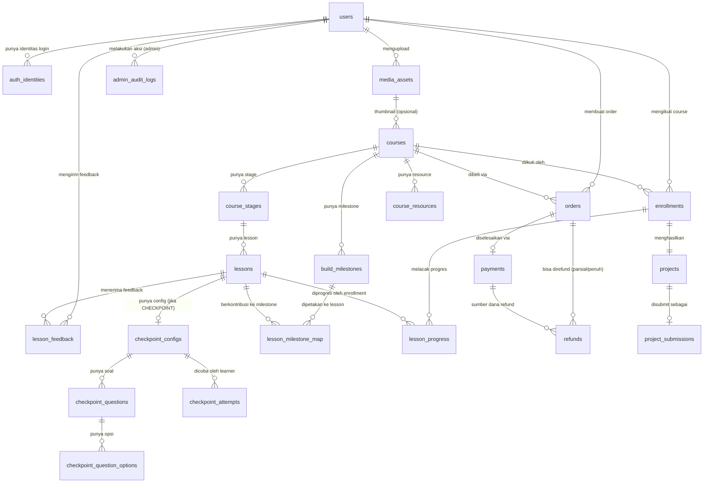

# DirakitPro — Draft Skema Database (Drizzle ORM / PostgreSQL)

> Sumber: `DirakitPro_MVP_PRD_Text_First_V1.4_EN.md` (§8–§16)
> Dibuat: 2026-08-27
> Status: **DRAFT untuk review** — belum ada scaffold project, belum ada migration file.

Dokumen ini merancang skema database awal untuk DirakitPro MVP (text-first LMS) berdasarkan PRD V1.4. Fokusnya adalah *bentuk data* dan *aturan integritas*, bukan implementasi final. Setiap keputusan desain yang tidak dijelaskan eksplisit oleh PRD ditandai sebagai asumsi di bagian 1 dan 5.

---

## 1. Ringkasan Pendekatan

### 1.1 Content block: JSONB, bukan tabel ternormalisasi

`Lesson.content` disimpan sebagai **satu kolom `jsonb`** berisi array block terurut (sesuai contoh §11.2), bukan tabel `lesson_blocks` terpisah per tipe block.

**Alasan:**
- Struktur block (`markdown`, `code`, `image`, `callout`, `resource_link`, `task`) sudah didefinisikan tetap di §8.4 (LRN-005) — tidak butuh query relasional per block, cukup dibaca sebagai satu dokumen saat render lesson.
- ADM-004/ADM-005 hanya butuh "Save Draft", bukan editor kolaboratif real-time — tidak ada kebutuhan mengunci/mengupdate satu block secara independen di level DB.
- §15.3 mensyaratkan "content changes do not require code deployment" dan validasi Zod di write boundary — ini paling murah dicapai dengan schema Zod discriminated-union yang memvalidasi seluruh array JSON sebelum disimpan, bukan constraint DB per kolom.
- Trade-off yang diterima: DB tidak bisa menjamin integritas per block (mis. `image` block mereferensikan `assetId` yang valid) secara relasional. Ini didorong ke validasi app-layer (lihat tabel bagian 4).

Pengecualian: **`CheckpointConfig`/`Question`/`Option` dinormalisasi ke tabel terpisah**, karena butuh grading otomatis (CHK-002), riwayat percobaan per pertanyaan berpotensi dianalisis (§13.3 "checkpoint dengan failure rate tertinggi"), dan opsi jawaban punya `isCorrect` yang tidak boleh bocor ke response publik — lebih aman dan lebih mudah dikontrol lewat kolom relasional daripada digabung ke JSONB lesson content.

### 1.2 Naming convention

- **Tabel**: `snake_case`, jamak (`courses`, `lesson_progress`).
- **Kolom**: `snake_case` di database, diekspos sebagai `camelCase` di objek Drizzle TypeScript (`createdAt` → kolom `created_at`).
- **Enum PostgreSQL**: `snake_case` diakhiri konteksnya (`course_status`, `enrollment_status`), nilai enum `SCREAMING_SNAKE_CASE` mengikuti istilah persis dari PRD §10.
- **Foreign key**: `<entity>_id` (mis. `course_id`, `user_id`).
- Istilah brand Bahasa Indonesia (**Mulai Merakit**, **Progress Rakitan**, dst — §4.2) **tidak** masuk ke nama kolom/tabel; itu murni istilah UI. Skema tetap pakai istilah teknis Inggris agar konsisten dengan ekosistem Drizzle/TypeScript.

### 1.3 Strategi ID

**UUID v4** (`gen_random_uuid()` via `defaultRandom()` Drizzle) untuk seluruh primary key.

Alasan: ID diekspos di URL publik (`/projects/[username]/[slug]`, `/learn/[courseSlug]/[lessonSlug]`, order/payment reference ke Midtrans), sehingga ID tidak boleh berurutan tebak-tebakan (`serial` membocorkan volume order/enrollment — masalah privasi/kompetitif). `cuid2` juga valid tapi UUID dipilih karena native ke tipe kolom PostgreSQL (`uuid`), diindeks lebih efisien dibanding `text`, dan didukung langsung oleh `pgcrypto`/`gen_random_uuid()` tanpa dependency tambahan.

Slug (`courses.slug`, `lessons.slug`, `projects.public_slug`) tetap dipakai sebagai *natural key* untuk routing, dengan unique constraint terpisah dari primary key UUID.

### 1.4 Konvensi timestamp

Semua tabel punya `created_at timestamptz not null default now()`. Tabel yang barisnya bisa diedit setelah dibuat (bukan snapshot/log) juga punya `updated_at timestamptz not null default now()`.

**Keputusan (resolusi open question §5 lama, no. 11): `updated_at` di-maintain via DB trigger, bukan disiplin app-layer.** Drizzle tidak punya `ON UPDATE` native seperti MySQL, dan mengandalkan setiap mutation untuk selalu menulis `updatedAt: new Date()` rawan lupa (satu server action yang miss langsung membuat data basi tanpa terdeteksi). Solusi paling aman dan best-practice di PostgreSQL:

```sql
-- migration terpisah (raw SQL), dijalankan setelah initial Drizzle migration
create or replace function set_updated_at()
returns trigger as $$
begin
  new.updated_at = now();
  return new;
end;
$$ language plpgsql;

-- lalu per tabel yang punya updated_at:
create trigger set_updated_at before update on courses
  for each row execute function set_updated_at();
-- ulangi untuk: course_stages, lessons, checkpoint_configs, checkpoint_questions,
-- enrollments, lesson_progress, orders*, payments, projects, project_submissions,
-- media_assets, users, build_milestones
```

*`orders` dikecualikan dari trigger ini — barisnya snapshot/immutable (lihat di bawah), jadi `updated_at` tidak relevan dan memang tidak dideklarasikan di §3.7.

Drizzle Kit tidak generate trigger dari schema TypeScript, jadi ini harus ditulis sebagai custom migration file manual (`drizzle/000x_updated_at_triggers.sql`) — dicatat sebagai langkah wajib di §6.

Tabel snapshot/immutable (`orders`, `admin_audit_logs`, `checkpoint_attempts`) **tidak** punya `updated_at` — barisnya secara desain tidak pernah diubah setelah insert (COM-002).

### 1.5 Auth: Clerk sebagai identity provider eksternal

Sesuai IAM-001/IAM-004, `users` adalah identitas internal LMS; `auth_identities` memetakan Clerk user ID ke `users.id`. Semua tabel domain (Enrollment, Order, Project, dst) selalu FK ke `users.id`, tidak pernah ke ID Clerk secara langsung.

### 1.6 Soft delete

**Keputusan (resolusi open question §5 lama, no. 1): soft delete dipakai untuk `courses`, `lessons`, dan `media_assets`.**

Ketiga tabel ini dipilih karena barisnya bisa direferensikan oleh riwayat yang harus tetap valid walau entity sumbernya "dihapus" dari sudut pandang pengguna:
- `courses`/`lessons` — enrollment lama, `lesson_progress`, `checkpoint_attempts`, dan `orders` (snapshot) tetap harus bisa di-render di riwayat learner walau course/lesson-nya sudah ditarik dari katalog oleh admin.
- `media_assets` — dipakai MED-005 (cek referensi sebelum hapus fisik dari storage); hard-delete langsung akan mematahkan `image` block di `lessons.content` JSONB yang masih mereferensikan asset itu.

Semua tiga tabel dapat kolom tambahan:
```ts
deletedAt: timestamp('deleted_at', { withTimezone: true }),
```
- `null` = baris aktif (default).
- Terisi = "dihapus" secara logis. Query katalog/publik/listing **wajib** menambahkan `WHERE deleted_at IS NULL` — didukung partial index di tabel yang butuh (lihat §3.3, §3.9).
- Tabel lain (`enrollments`, `orders`, `projects`, dst) **tidak** dapat soft delete — statusnya sendiri (`REVOKED`, `CANCELLED`, `HIDDEN`, dst) sudah cukup merepresentasikan "tidak aktif" tanpa perlu kolom terpisah, dan PRD tidak menyebut kebutuhan hapus untuk entity-entity itu.
- `users` **juga** dapat `deletedAt` (lihat §3.2) — bukan karena "hapus manual" dari admin, tapi sebagai target dari sinkronisasi webhook Clerk `user.deleted` (lihat §3.2.1), supaya FK `restrict` dari `orders`/`admin_audit_logs` tetap aman tanpa harus hard-delete user yang punya riwayat transaksi.

---

## 2. ERD Ringkas



Hierarki inti (§9.1): `Course → CourseStage → Lesson → (content blocks JSONB | CheckpointConfig | LessonProgress)`.

---

## 3. Draft Skema Drizzle

> Asumsi import: `import { pgTable, pgEnum, uuid, text, integer, boolean, timestamp, jsonb, uniqueIndex, index, primaryKey, check } from 'drizzle-orm/pg-core';` dan `import { sql } from 'drizzle-orm';`
> File nyata kemungkinan dipecah per domain (`schema/identity.ts`, `schema/catalog.ts`, dst) — di sini digabung satu alur agar mudah direview.

### 3.1 Enums (semua state machine §10 + enum pendukung)

```ts
// ---- Identity ----
export const userRoleEnum = pgEnum('user_role', ['LEARNER', 'ADMIN']);
export const authProviderEnum = pgEnum('auth_provider', ['CLERK']);

// ---- Catalog ----
export const courseStatusEnum = pgEnum('course_status', [
  'DRAFT',
  'PUBLISHED',
  'UNPUBLISHED',
]); // §10.6, CAT-003
export const courseLevelEnum = pgEnum('course_level', [
  'BEGINNER',
  'INTERMEDIATE',
  'ADVANCED',
]); // nilai diasumsikan — PRD tidak beri daftar pasti, lihat §5
export const resourceTypeEnum = pgEnum('resource_type', [
  'REPOSITORY',
  'ASSET_FILE',
  'DOCUMENTATION',
  'REFERENCE',
  'TOOLING',
]); // LRN-008

// ---- Curriculum ----
export const lessonTypeEnum = pgEnum('lesson_type', [
  'CONCEPT',
  'DEMO',
  'BUILD',
  'CHECKPOINT',
  'DEPLOY',
]); // LRN-004
export const lessonContentStatusEnum = pgEnum('lesson_content_status', [
  'DRAFT',
  'PUBLISHED',
]); // §10.6 — lesson publish independen dari course publish
export const lessonProgressStatusEnum = pgEnum('lesson_progress_status', [
  'NOT_STARTED',
  'STARTED',
  'COMPLETED',
]); // §10.3

// ---- Checkpoint ----
export const questionTypeEnum = pgEnum('question_type', [
  'SINGLE_CHOICE',
  'MULTIPLE_CHOICE',
]); // CHK-001

// ---- Commerce ----
export const orderStatusEnum = pgEnum('order_status', [
  'PENDING',
  'PAID',
  'EXPIRED',
  'CANCELLED',
  'REFUNDED',
]); // §10.1
export const paymentStatusEnum = pgEnum('payment_status', [
  'PENDING',
  'SUCCESS',
  'FAILED',
  'EXPIRED',
  'CANCELLED',
  'REFUNDED',
]); // status Midtrans dinormalisasi ke set internal ini (ADM-008)
export const refundStatusEnum = pgEnum('refund_status', [
  'PENDING',
  'SUCCESS',
  'FAILED',
]); // resolusi open question §5 lama, no. 10 — mirror alur refund Midtrans (request → diproses async)
export const enrollmentStatusEnum = pgEnum('enrollment_status', [
  'ACTIVE',
  'COMPLETED',
  'REVOKED',
]); // §10.2
export const enrollmentSourceEnum = pgEnum('enrollment_source', [
  'FREE',
  'PAID',
]);

// ---- Project ----
export const projectStatusEnum = pgEnum('project_status', [
  'DRAFT',
  'SUBMITTED',
]); // §10.4
export const projectVisibilityEnum = pgEnum('project_visibility', [
  'PRIVATE',
  'PUBLIC',
]); // §10.4
export const projectModerationStatusEnum = pgEnum('project_moderation_status', [
  'VISIBLE',
  'HIDDEN',
]); // §10.4, PRJ-006

// ---- Media ----
export const mediaOwnerScopeEnum = pgEnum('media_owner_scope', [
  'ADMIN_CONTENT',
  'LEARNER_PROJECT',
]); // §11.3

// ---- Feedback ----
export const feedbackKindEnum = pgEnum('feedback_kind', [
  'QUICK_FEEDBACK',
  'ISSUE_REPORT',
]);
export const feedbackLabelEnum = pgEnum('feedback_label', [
  'MUDAH_DIPAHAMI',
  'MEMBINGUNGKAN',
]); // FDB-001 — label tetap Bahasa Indonesia (copy learner-facing)
export const feedbackReportTypeEnum = pgEnum('feedback_report_type', [
  'TYPO',
  'BROKEN_LINK',
  'OUTDATED_INSTRUCTION',
  'CODE_NOT_WORKING',
  'IMAGE_ISSUE',
  'OTHER',
]); // FDB-002
```

### 3.2 Identity

```ts
export const users = pgTable('users', {
  id: uuid('id').primaryKey().defaultRandom(),
  role: userRoleEnum('role').notNull().default('LEARNER'),
  displayName: text('display_name').notNull(),
  email: text('email').notNull(), // dicermin dari Clerk, disinkronkan via webhook — lihat §3.2.1
  avatarUrl: text('avatar_url'),
  deletedAt: timestamp('deleted_at', { withTimezone: true }), // §1.6 — diisi saat webhook Clerk user.deleted diterima
  createdAt: timestamp('created_at', { withTimezone: true }).notNull().defaultNow(),
  updatedAt: timestamp('updated_at', { withTimezone: true }).notNull().defaultNow(),
}, (t) => ({
  emailUnique: uniqueIndex('users_email_unique').on(t.email),
}));

export const authIdentities = pgTable('auth_identities', {
  id: uuid('id').primaryKey().defaultRandom(),
  userId: uuid('user_id').notNull().references(() => users.id, { onDelete: 'cascade' }),
  provider: authProviderEnum('provider').notNull().default('CLERK'),
  providerUserId: text('provider_user_id').notNull(), // Clerk user id
  createdAt: timestamp('created_at', { withTimezone: true }).notNull().defaultNow(),
}, (t) => ({
  // IAM-001: satu identitas provider hanya boleh mengarah ke satu User.
  providerIdentityUnique: uniqueIndex('auth_identities_provider_unique').on(t.provider, t.providerUserId),
  userIdx: index('auth_identities_user_idx').on(t.userId),
}));
```

#### 3.2.1 Strategi Sinkronisasi Clerk → `users` (resolusi open question §5 lama, no. 9)

Clerk tetap jadi *source of truth* untuk identitas (password, sesi, MFA); tabel `users` cuma cermin read-optimized untuk kebutuhan internal (pencarian admin ADM-007, FK domain). Sinkronisasi lewat **Clerk webhook**, bukan polling atau sinkron saat login saja (supaya data tetap fresh walau user tidak login setelah update profil di Clerk).

**Endpoint**: `POST /api/webhooks/clerk`, diverifikasi pakai `svix` (Clerk mengirim webhook via Svix; verifikasi wajib pakai `CLERK_WEBHOOK_SIGNING_SECRET`, bukan cuma trust payload — sejalan dengan §16 baseline security).

**Event yang ditangani:**

| Event Clerk | Aksi di `users` / `auth_identities` |
|---|---|
| `user.created` | Insert `users` (mirror `email`, `displayName` dari `first_name`+`last_name`, `avatarUrl`) dalam transaksi yang sama dengan insert `auth_identities` (`provider='CLERK'`, `providerUserId=<clerk user id>`). |
| `user.updated` | Cari `auth_identities` by `providerUserId` → update `users.email/displayName/avatarUrl` + `updatedAt`. Kalau baris `auth_identities` belum ada (race dengan `user.created`), treat seperti create (upsert). |
| `user.deleted` | Set `users.deletedAt = now()`. **Tidak** hard-delete — FK `restrict` dari `orders`/`admin_audit_logs`/`media_assets.created_by_user_id` akan menolak hard-delete kalau user itu punya riwayat transaksi, dan soft-delete tetap menjaga riwayat learner/enrollment lama bisa direkonstruksi untuk audit. |

**Idempotensi**: upsert berbasis `ON CONFLICT (provider, provider_user_id) DO UPDATE` di `auth_identities`+`users` join, supaya retry webhook (Svix retry on failure) tidak membuat baris dobel — pola yang sama seperti idempotensi webhook Midtrans (COM-005).

**Konsekuensi login**: karena `users` adalah mirror, middleware auth tetap query session ke Clerk (`auth()` helper) untuk cek identitas per-request, tapi FK/query domain selalu lewat `users.id` internal (IAM-004) — webhook sync memastikan `users.id` itu terpetakan lebih cepat daripada request pertama user setelah signup.

### 3.3 Catalog & Curriculum

```ts
export const courses = pgTable('courses', {
  id: uuid('id').primaryKey().defaultRandom(),
  slug: text('slug').notNull(),
  title: text('title').notNull(),
  shortOutcome: text('short_outcome').notNull(), // CAT-001
  description: text('description').notNull(), // markdown, CAT-002
  targetLearner: text('target_learner'),
  prerequisites: jsonb('prerequisites').$type<string[]>().default([]),
  requiredTools: jsonb('required_tools').$type<string[]>().default([]),
  finalOutcomeDescription: text('final_outcome_description'), // CAT-002 "hasil akhir yang dibangun"
  // Konfigurasi field wajib untuk final project — tidak semua course butuh live URL (PRJ-003).
  finalProjectConfig: jsonb('final_project_config').$type<{
    requireLiveUrl: boolean;
    requireRepoUrl: boolean;
    requireScreenshot: boolean;
    allowTechList: boolean;
  }>().notNull(),
  level: courseLevelEnum('level').notNull().default('BEGINNER'),
  isFree: boolean('is_free').notNull().default(false), // CAT-004
  priceAmount: integer('price_amount').notNull().default(0), // rupiah, unit utuh (tanpa desimal)
  currency: text('currency').notNull().default('IDR'),
  status: courseStatusEnum('status').notNull().default('DRAFT'), // CAT-003
  thumbnailAssetId: uuid('thumbnail_asset_id').references(() => mediaAssets.id, { onDelete: 'set null' }),
  estimatedDurationMinutes: integer('estimated_duration_minutes'),
  isSequential: boolean('is_sequential').notNull().default(true), // LRN-007
  publishedAt: timestamp('published_at', { withTimezone: true }),
  deletedAt: timestamp('deleted_at', { withTimezone: true }), // §1.6 soft delete
  createdByUserId: uuid('created_by_user_id').notNull().references(() => users.id),
  createdAt: timestamp('created_at', { withTimezone: true }).notNull().defaultNow(),
  updatedAt: timestamp('updated_at', { withTimezone: true }).notNull().defaultNow(),
}, (t) => ({
  slugUnique: uniqueIndex('courses_slug_unique').on(t.slug),
  // Katalog publik hanya boleh lihat yang PUBLISHED dan belum dihapus — partial index mempercepat filter ganda ini.
  statusIdx: index('courses_status_idx').on(t.status).where(sql`${t.deletedAt} is null`),
  // CAT-004 & harga: kalau free, harga wajib 0; kalau berbayar, harga > 0.
  priceConsistency: check(
    'courses_price_consistency',
    sql`(${t.isFree} = true and ${t.priceAmount} = 0) or (${t.isFree} = false and ${t.priceAmount} > 0)`
  ),
}));

export const courseResources = pgTable('course_resources', {
  id: uuid('id').primaryKey().defaultRandom(),
  courseId: uuid('course_id').notNull().references(() => courses.id, { onDelete: 'cascade' }),
  type: resourceTypeEnum('type').notNull(),
  label: text('label').notNull(),
  url: text('url'), // untuk link (repo, dokumentasi, tooling)
  assetId: uuid('asset_id').references(() => mediaAssets.id, { onDelete: 'set null' }), // untuk ASSET_FILE
  order: integer('order').notNull(),
  createdAt: timestamp('created_at', { withTimezone: true }).notNull().defaultNow(),
}, (t) => ({
  courseOrderIdx: index('course_resources_course_order_idx').on(t.courseId, t.order),
}));

export const courseStages = pgTable('course_stages', {
  id: uuid('id').primaryKey().defaultRandom(),
  courseId: uuid('course_id').notNull().references(() => courses.id, { onDelete: 'cascade' }),
  title: text('title').notNull(),
  outcome: text('outcome'), // Appendix C: "Stage outcome"
  order: integer('order').notNull(),
  createdAt: timestamp('created_at', { withTimezone: true }).notNull().defaultNow(),
  updatedAt: timestamp('updated_at', { withTimezone: true }).notNull().defaultNow(),
}, (t) => ({
  // ADM-003: reorder stage tanpa tabrakan urutan.
  courseOrderUnique: uniqueIndex('course_stages_course_order_unique').on(t.courseId, t.order),
}));

export const lessons = pgTable('lessons', {
  id: uuid('id').primaryKey().defaultRandom(),
  stageId: uuid('stage_id').notNull().references(() => courseStages.id, { onDelete: 'cascade' }),
  courseId: uuid('course_id').notNull().references(() => courses.id, { onDelete: 'cascade' }), // denormalisasi untuk query & unique slug per-course
  slug: text('slug').notNull(),
  title: text('title').notNull(),
  type: lessonTypeEnum('type').notNull(), // LRN-004
  objective: text('objective'),
  estimatedTimeMinutes: integer('estimated_time_minutes'),
  // LRN-005 & §11.2 — array block terurut, divalidasi Zod discriminated union di write boundary.
  content: jsonb('content').$type<LessonContentBlock[]>().notNull().default([]),
  isRequired: boolean('is_required').notNull().default(true), // LRN-007
  order: integer('order').notNull(), // urutan dalam stage
  contentStatus: lessonContentStatusEnum('content_status').notNull().default('DRAFT'), // §10.6
  deletedAt: timestamp('deleted_at', { withTimezone: true }), // §1.6 soft delete
  createdAt: timestamp('created_at', { withTimezone: true }).notNull().defaultNow(),
  updatedAt: timestamp('updated_at', { withTimezone: true }).notNull().defaultNow(),
}, (t) => ({
  courseSlugUnique: uniqueIndex('lessons_course_slug_unique').on(t.courseId, t.slug), // route /learn/[courseSlug]/[lessonSlug]
  stageOrderUnique: uniqueIndex('lessons_stage_order_unique').on(t.stageId, t.order),
  courseTypeIdx: index('lessons_course_type_idx').on(t.courseId, t.type), // agregasi required lesson per course (§10.5)
  // Resolusi open question §5 lama, no. 4 — pengaman minimal di level DB selain Zod discriminated union app-layer:
  // memastikan kolom content SELALU berbentuk array JSON, tidak pernah object/scalar/null, walau isi tiap block
  // tetap divalidasi Zod di write boundary (CHECK tidak bisa memvalidasi struktur per block type).
  contentIsArray: check('lessons_content_is_array', sql`jsonb_typeof(${t.content}) = 'array'`),
}));
```

### 3.4 Checkpoint

```ts
export const checkpointConfigs = pgTable('checkpoint_configs', {
  id: uuid('id').primaryKey().defaultRandom(),
  lessonId: uuid('lesson_id').notNull().references(() => lessons.id, { onDelete: 'cascade' }),
  passingScore: integer('passing_score').notNull(), // persen 0-100, CHK-002
  allowRetry: boolean('allow_retry').notNull().default(true), // CHK-003 tanpa batas keras
  createdAt: timestamp('created_at', { withTimezone: true }).notNull().defaultNow(),
  updatedAt: timestamp('updated_at', { withTimezone: true }).notNull().defaultNow(),
}, (t) => ({
  // Satu lesson bertipe CHECKPOINT hanya boleh punya satu config (1:1).
  lessonUnique: uniqueIndex('checkpoint_configs_lesson_unique').on(t.lessonId),
}));

export const checkpointQuestions = pgTable('checkpoint_questions', {
  id: uuid('id').primaryKey().defaultRandom(),
  checkpointConfigId: uuid('checkpoint_config_id').notNull().references(() => checkpointConfigs.id, { onDelete: 'cascade' }),
  order: integer('order').notNull(),
  prompt: text('prompt').notNull(),
  type: questionTypeEnum('type').notNull(), // CHK-001
  explanation: text('explanation'), // ditampilkan setelah submit, CHK-002
  createdAt: timestamp('created_at', { withTimezone: true }).notNull().defaultNow(),
  updatedAt: timestamp('updated_at', { withTimezone: true }).notNull().defaultNow(),
}, (t) => ({
  configOrderUnique: uniqueIndex('checkpoint_questions_config_order_unique').on(t.checkpointConfigId, t.order),
}));

export const checkpointQuestionOptions = pgTable('checkpoint_question_options', {
  id: uuid('id').primaryKey().defaultRandom(),
  questionId: uuid('question_id').notNull().references(() => checkpointQuestions.id, { onDelete: 'cascade' }),
  order: integer('order').notNull(),
  label: text('label').notNull(),
  isCorrect: boolean('is_correct').notNull().default(false), // tidak pernah dikirim ke client sebelum submit — app-layer
  createdAt: timestamp('created_at', { withTimezone: true }).notNull().defaultNow(),
}, (t) => ({
  questionOrderUnique: uniqueIndex('checkpoint_options_question_order_unique').on(t.questionId, t.order),
}));

export const checkpointAttempts = pgTable('checkpoint_attempts', {
  id: uuid('id').primaryKey().defaultRandom(),
  checkpointConfigId: uuid('checkpoint_config_id').notNull().references(() => checkpointConfigs.id, { onDelete: 'cascade' }),
  userId: uuid('user_id').notNull().references(() => users.id, { onDelete: 'cascade' }),
  enrollmentId: uuid('enrollment_id').notNull().references(() => enrollments.id, { onDelete: 'cascade' }),
  score: integer('score').notNull(), // 0-100
  passed: boolean('passed').notNull(), // CHK-004
  // Snapshot jawaban per pertanyaan → opsi terpilih, untuk riwayat (CHK-003) tanpa tabel jawaban terpisah.
  answers: jsonb('answers').$type<Record<string, string[]>>().notNull(),
  attemptedAt: timestamp('attempted_at', { withTimezone: true }).notNull().defaultNow(),
}, (t) => ({
  // Riwayat percobaan per learner+checkpoint, terurut waktu (CHK-003, §13.3 checkpoint failure rate).
  configUserIdx: index('checkpoint_attempts_config_user_idx').on(t.checkpointConfigId, t.userId, t.attemptedAt),
  enrollmentIdx: index('checkpoint_attempts_enrollment_idx').on(t.enrollmentId),
}));
```

### 3.5 Build Milestone

```ts
export const buildMilestones = pgTable('build_milestones', {
  id: uuid('id').primaryKey().defaultRandom(),
  courseId: uuid('course_id').notNull().references(() => courses.id, { onDelete: 'cascade' }),
  title: text('title').notNull(), // mis. "Project Setup", "First Screen" (BLD-001)
  description: text('description'),
  order: integer('order').notNull(),
  isRequired: boolean('is_required').notNull().default(true),
  createdAt: timestamp('created_at', { withTimezone: true }).notNull().defaultNow(),
  updatedAt: timestamp('updated_at', { withTimezone: true }).notNull().defaultNow(),
}, (t) => ({
  courseOrderUnique: uniqueIndex('build_milestones_course_order_unique').on(t.courseId, t.order),
}));

export const lessonMilestoneMap = pgTable('lesson_milestone_map', {
  milestoneId: uuid('milestone_id').notNull().references(() => buildMilestones.id, { onDelete: 'cascade' }),
  lessonId: uuid('lesson_id').notNull().references(() => lessons.id, { onDelete: 'cascade' }),
  createdAt: timestamp('created_at', { withTimezone: true }).notNull().defaultNow(),
}, (t) => ({
  // BLD-002: satu lesson bisa dipetakan ke banyak milestone, tapi tidak boleh dobel ke milestone yang sama.
  pk: primaryKey({ columns: [t.milestoneId, t.lessonId] }),
  lessonIdx: index('lesson_milestone_map_lesson_idx').on(t.lessonId),
}));
```

### 3.6 Enrollment & Progress

```ts
export const enrollments = pgTable('enrollments', {
  id: uuid('id').primaryKey().defaultRandom(),
  userId: uuid('user_id').notNull().references(() => users.id, { onDelete: 'cascade' }),
  courseId: uuid('course_id').notNull().references(() => courses.id, { onDelete: 'cascade' }),
  status: enrollmentStatusEnum('status').notNull().default('ACTIVE'), // §10.2
  source: enrollmentSourceEnum('source').notNull(), // FREE (CAT-004) atau PAID (webhook)
  activatedAt: timestamp('activated_at', { withTimezone: true }).notNull().defaultNow(),
  completedAt: timestamp('completed_at', { withTimezone: true }),
  revokedAt: timestamp('revoked_at', { withTimezone: true }),
  createdAt: timestamp('created_at', { withTimezone: true }).notNull().defaultNow(),
  updatedAt: timestamp('updated_at', { withTimezone: true }).notNull().defaultNow(),
}, (t) => ({
  // COM-005 (idempotent) + COM-007 (already-owned block) + "satu enrollment per user+course": backstop DB.
  userCourseUnique: uniqueIndex('enrollments_user_course_unique').on(t.userId, t.courseId),
  courseStatusIdx: index('enrollments_course_status_idx').on(t.courseId, t.status), // admin learner view, funnel §13
}));

export const lessonProgress = pgTable('lesson_progress', {
  id: uuid('id').primaryKey().defaultRandom(),
  enrollmentId: uuid('enrollment_id').notNull().references(() => enrollments.id, { onDelete: 'cascade' }),
  lessonId: uuid('lesson_id').notNull().references(() => lessons.id, { onDelete: 'cascade' }),
  userId: uuid('user_id').notNull().references(() => users.id, { onDelete: 'cascade' }), // denormalisasi, hindari join lewat enrollment untuk query admin/analytics
  status: lessonProgressStatusEnum('status').notNull().default('NOT_STARTED'), // §10.3
  startedAt: timestamp('started_at', { withTimezone: true }),
  completedAt: timestamp('completed_at', { withTimezone: true }),
  createdAt: timestamp('created_at', { withTimezone: true }).notNull().defaultNow(),
  updatedAt: timestamp('updated_at', { withTimezone: true }).notNull().defaultNow(),
}, (t) => ({
  enrollmentLessonUnique: uniqueIndex('lesson_progress_enrollment_lesson_unique').on(t.enrollmentId, t.lessonId),
  // §13.3: "lesson mana yang paling banyak drop-off" — agregasi per lesson+status.
  lessonStatusIdx: index('lesson_progress_lesson_status_idx').on(t.lessonId, t.status),
  userStatusIdx: index('lesson_progress_user_status_idx').on(t.userId, t.status),
}));
```

### 3.7 Commerce

```ts
export const orders = pgTable('orders', {
  id: uuid('id').primaryKey().defaultRandom(),
  userId: uuid('user_id').notNull().references(() => users.id, { onDelete: 'restrict' }),
  courseId: uuid('course_id').notNull().references(() => courses.id, { onDelete: 'restrict' }),
  // Snapshot immutable (COM-002) — tidak pernah di-update setelah insert.
  courseTitleSnapshot: text('course_title_snapshot').notNull(),
  priceAmountSnapshot: integer('price_amount_snapshot').notNull(),
  currencySnapshot: text('currency_snapshot').notNull(),
  totalAmount: integer('total_amount').notNull(),
  status: orderStatusEnum('status').notNull().default('PENDING'), // §10.1
  // Resolusi open question §5 lama, no. 8 — durasi disamakan dengan expiry token Midtrans Snap
  // (default 24 jam sejak createdAt kalau tidak di-override lewat parameter `expiry` saat create transaction).
  // Transisi PENDING → EXPIRED **otoritatif** lewat webhook Midtrans (`transaction_status: "expire"`, sesuai COM-004),
  // bukan cron. expiresAt di sini murni untuk tampilan UI (countdown Snap) dan sebagai backstop opsional:
  // scheduled job (mis. Vercel Cron) boleh sweep `status='PENDING' AND expires_at < now()` lalu KONFIRMASI ke
  // Midtrans status API sebelum flip status — bukan langsung percaya jam server sendiri.
  expiresAt: timestamp('expires_at', { withTimezone: true }), // batas PENDING → EXPIRED
  createdAt: timestamp('created_at', { withTimezone: true }).notNull().defaultNow(),
  updatedAt: timestamp('updated_at', { withTimezone: true }).notNull().defaultNow(),
}, (t) => ({
  // COM-006: maksimal satu order PENDING per user+course — partial unique index.
  pendingPerUserCourseUnique: uniqueIndex('orders_pending_user_course_unique')
    .on(t.userId, t.courseId)
    .where(sql`${t.status} = 'PENDING'`),
  statusCreatedIdx: index('orders_status_created_idx').on(t.status, t.createdAt), // admin order view, expiry sweep
  userIdx: index('orders_user_idx').on(t.userId), // COM-008 order history
}));

export const payments = pgTable('payments', {
  id: uuid('id').primaryKey().defaultRandom(),
  orderId: uuid('order_id').notNull().references(() => orders.id, { onDelete: 'cascade' }),
  provider: text('provider').notNull().default('MIDTRANS'),
  providerOrderId: text('provider_order_id').notNull(), // order_id yang dikirim ke Midtrans
  providerTransactionId: text('provider_transaction_id'), // transaction_id dari Midtrans, terisi setelah ada transaksi
  status: paymentStatusEnum('status').notNull().default('PENDING'),
  rawProviderStatus: text('raw_provider_status'), // status verbatim Midtrans untuk debug (mis. "capture", "settlement")
  amount: integer('amount').notNull(),
  paymentType: text('payment_type'), // mis. "credit_card", "gopay"
  signatureVerified: boolean('signature_verified').notNull().default(false), // COM-004/§16 wajib verifikasi signature
  webhookPayload: jsonb('webhook_payload'), // payload webhook terakhir, untuk audit/debug
  paidAt: timestamp('paid_at', { withTimezone: true }),
  createdAt: timestamp('created_at', { withTimezone: true }).notNull().defaultNow(),
  updatedAt: timestamp('updated_at', { withTimezone: true }).notNull().defaultNow(),
}, (t) => ({
  // COM-005: kunci idempotensi webhook — retry dengan providerOrderId sama tidak membuat baris baru.
  providerOrderUnique: uniqueIndex('payments_provider_order_unique').on(t.providerOrderId),
  orderIdx: index('payments_order_idx').on(t.orderId),
}));

// Resolusi open question §5 lama, no. 10 — kebijakan proses refund (approval, timeline, jumlah) sepenuhnya
// mengikuti Midtrans, tapi DirakitPro tetap butuh tabel sendiri: `orders.status = REFUNDED` di §10.1 cuma
// merepresentasikan "refund penuh selesai", tidak cukup untuk melacak refund parsial, alasan, siapa yang
// memicu (admin manual vs otomatis dari webhook), atau riwayat kalau ada lebih dari satu refund request per order.
export const refunds = pgTable('refunds', {
  id: uuid('id').primaryKey().defaultRandom(),
  orderId: uuid('order_id').notNull().references(() => orders.id, { onDelete: 'restrict' }),
  paymentId: uuid('payment_id').notNull().references(() => payments.id, { onDelete: 'restrict' }),
  amount: integer('amount').notNull(), // rupiah — bisa parsial atau penuh, mengikuti kebijakan refund Midtrans
  reason: text('reason'), // alasan refund, diisi admin saat memicu manual
  status: refundStatusEnum('status').notNull().default('PENDING'),
  providerRefundId: text('provider_refund_id'), // refund_key dari response refund API Midtrans
  rawProviderResponse: jsonb('raw_provider_response'), // payload response/webhook refund Midtrans, untuk audit/debug
  processedByUserId: uuid('processed_by_user_id').references(() => users.id, { onDelete: 'set null' }), // admin pemicu; null kalau otomatis dari webhook
  requestedAt: timestamp('requested_at', { withTimezone: true }).notNull().defaultNow(),
  completedAt: timestamp('completed_at', { withTimezone: true }), // terisi saat Midtrans konfirmasi SUCCESS/FAILED
}, (t) => ({
  orderIdx: index('refunds_order_idx').on(t.orderId),
  statusIdx: index('refunds_status_idx').on(t.status), // admin refund queue
}));
```

Catatan alur: `orders.status` di-set `REFUNDED` oleh app-layer hanya ketika total `refunds.amount` (status `SUCCESS`) untuk order itu sudah menyamai `orders.totalAmount` (refund penuh). Refund parsial tercatat di `refunds` tanpa mengubah `orders.status` — konsisten dengan §10.1 yang hanya mendefinisikan transisi `PAID → REFUNDED` sebagai kondisi penuh.

### 3.8 Project

```ts
export const projects = pgTable('projects', {
  id: uuid('id').primaryKey().defaultRandom(),
  enrollmentId: uuid('enrollment_id').notNull().references(() => enrollments.id, { onDelete: 'cascade' }),
  userId: uuid('user_id').notNull().references(() => users.id, { onDelete: 'cascade' }), // denormalisasi
  courseId: uuid('course_id').notNull().references(() => courses.id, { onDelete: 'cascade' }), // denormalisasi
  status: projectStatusEnum('status').notNull().default('DRAFT'), // §10.4, PRJ-001 auto-create
  visibility: projectVisibilityEnum('visibility').notNull().default('PRIVATE'), // PRJ-004
  moderationStatus: projectModerationStatusEnum('moderation_status').notNull().default('VISIBLE'), // PRJ-006
  publicSlug: text('public_slug'), // untuk /projects/[username]/[slug], hanya terisi saat pertama kali PUBLIC
  createdAt: timestamp('created_at', { withTimezone: true }).notNull().defaultNow(),
  updatedAt: timestamp('updated_at', { withTimezone: true }).notNull().defaultNow(),
}, (t) => ({
  enrollmentUnique: uniqueIndex('projects_enrollment_unique').on(t.enrollmentId), // 1 project per enrollment
  publicSlugUnique: uniqueIndex('projects_public_slug_unique').on(t.publicSlug),
  // PRJ-005/006: query halaman publik & moderasi admin.
  visibilityModerationIdx: index('projects_visibility_moderation_idx').on(t.visibility, t.moderationStatus),
}));

// Resolusi open question §5 lama, no. 3 (versioning submission) — best practice yang dipilih: TETAP satu baris
// per project, diedit in-place (tidak ada tabel riwayat/`is_current` di MVP). Alasan: PRD tidak menyebut kebutuhan
// audit-trail atau "lihat submission versi sebelumnya" di scope MVP (§8 PRJ-001–007, §17 DoD) — membangun tabel
// riwayat sekarang adalah speculative infrastructure (YAGNI). Desain unique 1:1 (`projectUnique` di bawah) tetap
// dipertahankan supaya kalau kebutuhan versioning muncul di fase berikutnya, migrasinya cukup ADDITIVE:
// tambah tabel baru `project_submission_revisions` (snapshot append-only, FK ke projectId) tanpa mengubah/memecah
// tabel ini — tidak ada breaking change ke schema yang sudah ada.
export const projectSubmissions = pgTable('project_submissions', {
  id: uuid('id').primaryKey().defaultRandom(),
  projectId: uuid('project_id').notNull().references(() => projects.id, { onDelete: 'cascade' }),
  title: text('title').notNull(),
  description: text('description'),
  liveUrl: text('live_url'), // divalidasi http(s) di app-layer, PRJ-003
  repoUrl: text('repo_url'),
  screenshotAssetId: uuid('screenshot_asset_id').references(() => mediaAssets.id, { onDelete: 'set null' }),
  technologies: jsonb('technologies').$type<string[]>().default([]),
  submittedAt: timestamp('submitted_at', { withTimezone: true }).notNull().defaultNow(),
  createdAt: timestamp('created_at', { withTimezone: true }).notNull().defaultNow(),
  updatedAt: timestamp('updated_at', { withTimezone: true }).notNull().defaultNow(),
}, (t) => ({
  // Diasumsikan submission di-edit in-place (bukan riwayat versi) — lihat §5 open question.
  projectUnique: uniqueIndex('project_submissions_project_unique').on(t.projectId),
}));
```

### 3.9 Media

```ts
export const mediaAssets = pgTable('media_assets', {
  id: uuid('id').primaryKey().defaultRandom(),
  ownerScope: mediaOwnerScopeEnum('owner_scope').notNull(), // §11.3
  courseId: uuid('course_id').references(() => courses.id, { onDelete: 'set null' }), // untuk ADM-006 image library per-course (ADMIN_CONTENT)
  storageProvider: text('storage_provider').notNull().default('R2'),
  storageKey: text('storage_key').notNull(), // key acak, bukan nama file asli (§16)
  publicUrl: text('public_url'),
  mimeType: text('mime_type').notNull(),
  fileSize: integer('file_size').notNull(), // bytes, dicek <= 5MB di app-layer (MED-002)
  width: integer('width'),
  height: integer('height'),
  originalFilenameSanitized: text('original_filename_sanitized').notNull(),
  createdByUserId: uuid('created_by_user_id').notNull().references(() => users.id, { onDelete: 'restrict' }),
  deletedAt: timestamp('deleted_at', { withTimezone: true }), // §1.6 soft delete — cek referensi (MED-005) sebelum hard-delete objek storage
  createdAt: timestamp('created_at', { withTimezone: true }).notNull().defaultNow(),
  updatedAt: timestamp('updated_at', { withTimezone: true }).notNull().defaultNow(),
}, (t) => ({
  storageKeyUnique: uniqueIndex('media_assets_storage_key_unique').on(t.storageKey),
  courseScopeIdx: index('media_assets_course_scope_idx').on(t.courseId, t.ownerScope), // ADM-006 image library
}));
```

### 3.10 Feedback & Audit

```ts
export const lessonFeedback = pgTable('lesson_feedback', {
  id: uuid('id').primaryKey().defaultRandom(),
  lessonId: uuid('lesson_id').notNull().references(() => lessons.id, { onDelete: 'cascade' }),
  userId: uuid('user_id').notNull().references(() => users.id, { onDelete: 'cascade' }),
  kind: feedbackKindEnum('kind').notNull(), // QUICK_FEEDBACK (FDB-001) atau ISSUE_REPORT (FDB-002)
  label: feedbackLabelEnum('label'), // hanya untuk QUICK_FEEDBACK
  reportType: feedbackReportTypeEnum('report_type'), // hanya untuk ISSUE_REPORT
  comment: text('comment'),
  createdAt: timestamp('created_at', { withTimezone: true }).notNull().defaultNow(),
}, (t) => ({
  lessonCreatedIdx: index('lesson_feedback_lesson_created_idx').on(t.lessonId, t.createdAt), // §13.3, FDB-003 admin list
}));

export const adminAuditLogs = pgTable('admin_audit_logs', {
  id: uuid('id').primaryKey().defaultRandom(),
  actorUserId: uuid('actor_user_id').notNull().references(() => users.id, { onDelete: 'restrict' }),
  action: text('action').notNull(), // mis. 'COURSE_PUBLISH', 'COURSE_PRICE_CHANGE', 'PROJECT_HIDE' — ADM-010
  entityType: text('entity_type').notNull(), // 'course' | 'lesson' | 'order' | 'project' | ...
  entityId: uuid('entity_id').notNull(),
  metadata: jsonb('metadata'), // before/after value bebas bentuk
  createdAt: timestamp('created_at', { withTimezone: true }).notNull().defaultNow(),
}, (t) => ({
  entityIdx: index('admin_audit_logs_entity_idx').on(t.entityType, t.entityId, t.createdAt),
  actorIdx: index('admin_audit_logs_actor_idx').on(t.actorUserId, t.createdAt),
}));
```

> **Catatan implementasi:** `LessonContentBlock` (union type untuk kolom `lessons.content`) sebaiknya didefinisikan sebagai Zod schema di `schema/lesson-content.ts` dan di-infer ke TypeScript type, dipakai baik oleh Drizzle `$type<...>()` maupun validasi di server action lesson editor (ADM-004) — bukan didefinisikan dua kali.

---

## 4. Pemetaan Aturan Bisnis → Enforcement

| Aturan PRD | Mekanisme enforcement | Level |
|---|---|---|
| IAM-001 (satu identity provider = satu User) | `auth_identities.provider_user_id` unique per provider | DB constraint |
| IAM-004 (isolasi internal user id) | Semua FK domain menunjuk `users.id`, tidak pernah provider ID | Skema/desain |
| CAT-003 (UNPUBLISHED tidak bisa dibeli, tapi enrolled tetap akses) | `courses.status` sebagai sumber kebenaran; app-layer cek status saat create order, **tidak** cek status saat mengakses lesson yang enrollment-nya sudah ACTIVE | App-layer + query |
| COM-002 (order snapshot immutable) | Kolom `*_snapshot` di `orders`; konvensi kode — tidak ada mutation path yang meng-update kolom snapshot setelah insert (tabel ini sengaja dikecualikan dari trigger `updated_at`, lihat §1.4) | App-layer (code review discipline) |
| COM-004/COM-003 (webhook otoritatif, kredensial server-only) | `payments.signature_verified`, kredensial Midtrans hanya di server action/route handler | App-layer |
| **COM-005** (idempotent enrollment) | `enrollments` unique `(user_id, course_id)` + `payments` unique `provider_order_id` — webhook retry pakai `INSERT ... ON CONFLICT DO NOTHING` | DB constraint (backstop) + app-layer upsert |
| **COM-006** (maks 1 order PENDING per user+course) | Partial unique index `orders_pending_user_course_unique` `WHERE status = 'PENDING'` | DB constraint |
| **COM-007** (blokir order jika sudah ACTIVE/COMPLETED) | App-layer query `enrollments` sebelum insert `orders`; tidak murni DB constraint karena melibatkan 2 tabel dengan kondisi status berbeda | App-layer (wajib test — §17.1 daftar ini eksplisit sebagai critical test) |
| Satu Enrollment per user+course | `enrollments` unique `(user_id, course_id)` | DB constraint |
| LRN-007 (sequential progression) | Dihitung dari `lessons.order` + `is_required` + `lesson_progress.status` saat request; tidak disimpan sebagai kolom terpisah | App-layer (query time) |
| CHK-004 (checkpoint completed saat lulus) | App-layer set `lesson_progress.status = COMPLETED` dalam transaksi yang sama dengan insert `checkpoint_attempts` saat `passed = true` | App-layer (transaksi) |
| BLD-003 (milestone auto-complete) | App-layer agregasi: semua lesson di `lesson_milestone_map` untuk satu milestone berstatus COMPLETED di `lesson_progress` | App-layer (query/derived, tidak disimpan) |
| §10.5 (course completion 4 syarat) | App-layer agregasi lintas `lesson_progress`, `lesson_milestone_map`, `checkpoint_attempts`, `project_submissions`; hasil ditulis ke `enrollments.status = COMPLETED` + `completed_at` | App-layer (transaksi saat trigger terakhir terpenuhi) |
| PRJ-001 (auto-create Project DRAFT) | App-layer: insert `projects` dalam transaksi yang sama saat `enrollments.status` diset ACTIVE | App-layer (transaksi) |
| PRJ-003 (URL well-formed) | Validasi Zod `.url()` dengan protocol http/https di write boundary `project_submissions` | App-layer (Zod) |
| PRJ-004 (default PRIVATE) | `projects.visibility` default `'PRIVATE'` | DB default |
| PRJ-005/PRJ-006 (halaman publik hanya utk VISIBLE+PUBLIC) | Query publik selalu filter `visibility = 'PUBLIC' AND moderation_status = 'VISIBLE'`, didukung index `visibility_moderation_idx` | App-layer query + DB index |
| MED-002 (validasi upload: MIME, size, dimensi, ownership) | Validasi terjadi **sebelum** insert `media_assets` (di route/server action upload); DB hanya menyimpan hasil yang sudah tervalidasi | App-layer |
| MED-004 (alt text wajib kecuali decorative) | Divalidasi di Zod schema block `image` pada `lessons.content`, bukan constraint DB (karena block ada di JSONB) | App-layer (Zod) |
| MED-005 (hapus asset aman jika masih dipakai lesson lain) | `mediaAssets` tidak di-hard-delete otomatis; app-layer cek referensi (`lessons.content` JSONB scan / index terpisah) sebelum hapus objek storage | App-layer |
| §16 (no raw HTML content) | Tidak ada block type `html`; block `markdown` disanitasi/di-escape saat render, bukan saat simpan | Skema/desain + app-layer render |
| §16 (project hanya bisa diedit pemilik) | App-layer authorization: `project.user_id === session.userId` di setiap mutation `project_submissions`/`projects` | App-layer |
| §16 (rate limiting mutasi publik berisiko) | Bukan concern DB; namun unique constraint (`orders_pending_user_course_unique`, `enrollments_user_course_unique`) jadi lapisan pertahanan terakhir kalau rate limiter tembus akibat race condition | DB constraint (defense-in-depth) + middleware |
| ADM-010 (audit log mutasi sensitif) | App-layer service wrapper insert ke `admin_audit_logs` di setiap mutation: publish/unpublish course, price change, lesson publish, project hide/unhide | App-layer |
| MED-005 (hapus asset aman — soft delete) | `media_assets.deleted_at` diisi (bukan hard-delete row/objek storage) sampai app-layer memverifikasi tidak ada `lessons.content` JSONB lain yang mereferensikan `assetId` tsb | DB kolom (§1.6) + App-layer |
| Katalog/listing tidak menampilkan entity terhapus | Query katalog/listing **wajib** `WHERE deleted_at IS NULL` di `courses`, `lessons`, `media_assets` — didukung partial index `courses_status_idx` | App-layer query + DB partial index |
| Integritas `lessons.content` selalu berbentuk array | `CHECK (jsonb_typeof(content) = 'array')` di tabel `lessons` — pengaman minimal DB, struktur per block tetap divalidasi Zod | DB constraint + App-layer (Zod) |
| `updated_at` selalu akurat tanpa disiplin manual | Trigger PostgreSQL `set_updated_at()` di setiap tabel mutable (kecuali `orders`) — lihat §1.4 | DB trigger |
| Sinkronisasi identitas Clerk → `users` tidak drift | Webhook `/api/webhooks/clerk` (verifikasi Svix) menangani `user.created/updated/deleted`, upsert idempoten ke `users`+`auth_identities` — lihat §3.2.1 | App-layer (webhook handler) |
| Refund parsial/penuh tercatat terpisah dari status order | Tabel `refunds` (FK `order_id`, `payment_id`); `orders.status = REFUNDED` hanya di-set saat total refund `SUCCESS` menyamai `totalAmount` | DB tabel + App-layer agregasi |

---

## 5. Keputusan yang Sudah Dikonfirmasi

> Bagian ini sebelumnya berisi 11 pertanyaan terbuka yang menunggu keputusan pemilik produk. Semua sudah dijawab (2026-08-27) dan sudah diterapkan ke skema di §1 dan §3. Ringkasan keputusan dicatat di sini sebagai jejak audit — bukan lagi pertanyaan aktif.

| # | Topik | Keputusan | Diterapkan di |
|---|---|---|---|
| 1 | Soft delete vs hard delete | Soft delete (`deleted_at`) untuk `courses`, `lessons`, `media_assets`. Tabel lain pakai status field yang sudah ada, tidak butuh `deleted_at` terpisah. | §1.6, §3.3, §3.9 |
| 2 | Gabung `Project`+`ProjectSubmission`? | **Tidak digabung** — tetap dua tabel terpisah dengan relasi 1:1, sesuai bahasa PRD §11.1. | §3.8 (tidak berubah) |
| 3 | Versioning submission | Tidak dibangun untuk MVP (YAGNI — PRD tidak menyebut kebutuhan riwayat). Desain tetap additive-friendly: tabel riwayat baru bisa ditambah nanti tanpa breaking change. | §3.8 (komentar) |
| 4 | Validasi JSONB content block | Ditambahkan pengaman minimal `CHECK (jsonb_typeof(content) = 'array')` di `lessons`, di atas validasi Zod app-layer yang sudah ada. | §3.3 (lessons) |
| 5 | Normalisasi `checkpoint_attempts.answers` | Ditunda (menyusul di fase berikutnya kalau analitik per-pertanyaan dibutuhkan) — tidak ada perubahan skema sekarang. | Tidak berubah |
| 6 | Multi-tenancy | Tetap single-tenant — tidak ada kolom `tenant_id`. Satu platform, satu payment gateway (Midtrans), satu currency (IDR). | Tidak berubah (dikonfirmasi eksplisit) |
| 7 | Nilai enum `courses.level` | Dikonfirmasi tetap `BEGINNER \| INTERMEDIATE \| ADVANCED` (asumsi awal dipakai sebagai keputusan final, sesuai arahan "best practice"). | §3.1 (tidak berubah) |
| 8 | Order expiry | Durasi & trigger transisi disamakan dengan Midtrans: `expiresAt` ≈ 24 jam (default Snap) untuk UI, transisi `PENDING→EXPIRED` **otoritatif** lewat webhook `transaction_status: expire`, cron hanya backstop opsional. | §3.7 (orders, komentar) |
| 9 | Sinkronisasi Clerk → `users` | Dirancang: webhook `/api/webhooks/clerk` + Svix signature verification, event `user.created/updated/deleted`, upsert idempoten, `user.deleted` → soft-delete `users`. | §3.2.1 (baru) |
| 10 | Refund granularity | Kebijakan proses ikut Midtrans, tapi DirakitPro tetap punya tabel `refunds` terpisah (amount, reason, provider refund id, status) untuk audit & dukung refund parsial. | §3.7 (tabel `refunds` baru) |
| 11 | Trigger `updated_at` | Best practice dipilih: DB trigger PostgreSQL (`set_updated_at()` + `BEFORE UPDATE` per tabel), bukan disiplin app-layer semata. | §1.4 |

---

## 6. Langkah Selanjutnya

Skema di dokumen ini sudah final untuk MVP — semua trade-off di §5 sudah dikonfirmasi pemilik produk dan diterapkan. Langkah berikutnya:

1. **Fase 0 — Scaffold project**: inisialisasi Next.js 16 + pnpm/Turborepo + Drizzle + PostgreSQL sesuai §14.2 PRD.
2. **Migration awal**: generate migration Drizzle dari schema TypeScript final (§3), lalu tulis **migration custom tambahan** (raw SQL, tidak bisa di-generate Drizzle Kit) untuk:
   - Fungsi + trigger `set_updated_at()` (§1.4) di semua tabel mutable kecuali `orders`.
   - Constraint `CHECK` yang butuh `sql\`...\`` template kompleks (sudah didefinisikan inline di §3, tinggal diverifikasi hasil generate-nya).
3. **Webhook handlers**: implementasi `/api/webhooks/clerk` (§3.2.1) dan `/api/webhooks/midtrans` (existing design COM-004/005) sebagai bagian awal Fase 3 (Identity & Commerce).
4. **Seed data**: siapkan seed minimal (1 course contoh dengan semua lesson type termasuk CHECKPOINT) untuk development lokal, sebelum admin authoring UI (ADM) dibangun.
